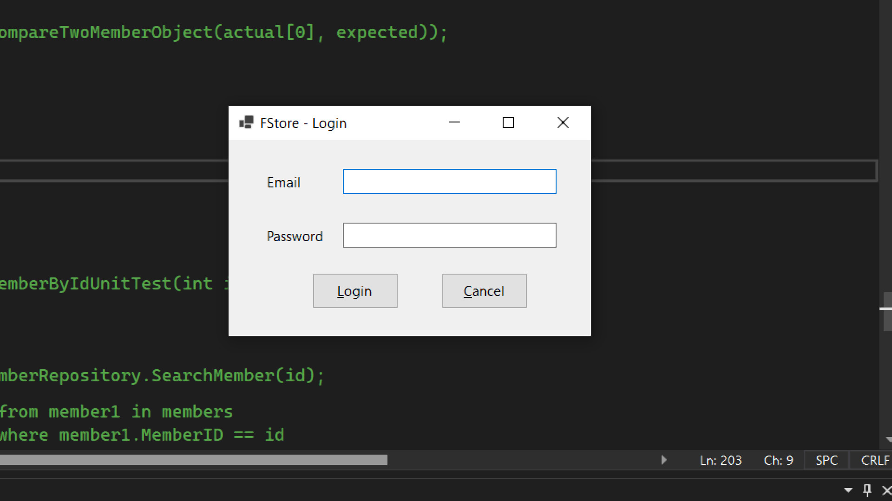
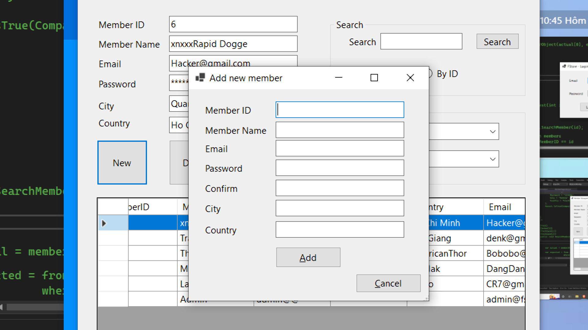
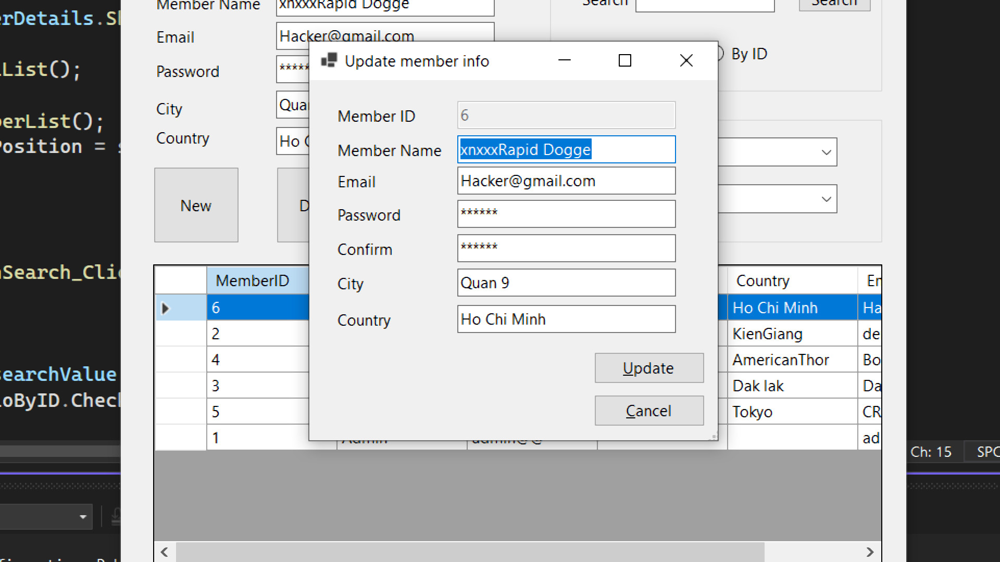

# Member Management With NUnit Test

:wave: Assignment 1 PRN112 (Basic Cross-Platform Application Programming With .NET) :wave:

## Table of Contents
- [Description](#description)
- [Preview Screenshot](#preview-screenshot)
- [Technology](#technology)
- [Functional requirements](#functional-requirements)
- [Useful Resources](#useful-resources)
- [Contributors](#contributors)
- [Reference](#reference)
- [License & Copyright](#license--copyright)

## Description
- Mini project manage member with windowform 
- Assignment 1 crouse Basic Cross-Platform Application Programming With .NET

## Preview Screenshot

  
  </img> &nbsp;&nbsp; 
  </img> &nbsp;&nbsp; 
  </img> &nbsp;&nbsp;
  </img> &nbsp;&nbsp;
  

  
## Technology
  - Singleton pattern
  - Windowform
  - .Net Core 
  - Visual Studio 2022
  - NUnit3

## Functional requirements

**1. Member**
- [x] Login
- [x] Update information
- [x] Logout

**2. Admin:**
- [x] Login
- [x] CRUD members
- [x] Logout

## Useful Resources

#| Name | Description
-| ---- | -----------
1| [Requirement document](https://github.com/denkhotieu/software-testing-with-nunit/blob/main/Assignment_01_MemberManagement.pdf) | -

## Contributors
- [Tran Minh Thien](https://github.com/Denkhotieu) - SE160413 
- [Phan Truong Minh Dang](#)  
- [Do Thanh Bo](#)  
- [Huynh Hoang Khoi Nguye](#)  

## Reference

- [NUnit 3 ](https://docs.nunit.org/index.html)

## License & Copyright
&copy; 2021 TranMinhThien.
